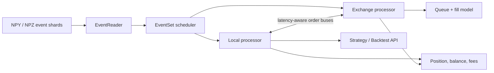

# hftbacktest-cpp

> **Project lineage:** `hftbacktest-cpp` is a C++20 port of [HftBacktest](https://github.com/nkaz001/hftbacktest), originally created by [nkaz001](https://github.com/nkaz001) and developed with its contributors. This independent port is not affiliated with or endorsed by the upstream project.

[](https://github.com/shenron0101/hftbacktest-cpp/actions/workflows/ci.yml)
[](https://github.com/shenron0101/hftbacktest-cpp/actions/workflows/codeql.yml)
[](https://isocpp.org/)
[](LICENSE)


A compact, installable C++20 event-driven backtesting core for limit-order-book research. It models local and exchange clocks, order entry and response latency, queue position, exchange fills, fees, inventory, and sharded NumPy event input.

This is an early `0.1.x` port. Its architecture and algorithms originate in the upstream HftBacktest project; this repository supplies an independent C++ implementation and packaging.

## Quick start

Requirements: CMake 3.20+, a C++20 compiler, zlib, and Git. GCC and Clang are tested on Linux; AppleClang is tested on macOS.

```sh
git clone https://github.com/shenron0101/hftbacktest-cpp.git
cmake -S hftbacktest-cpp -B hftbacktest-cpp/build -DCMAKE_BUILD_TYPE=Release
cmake --build hftbacktest-cpp/build --parallel
ctest --test-dir hftbacktest-cpp/build --output-on-failure
./hftbacktest-cpp/build/hbt_market_making
```

Deterministic example output:

```text
book ts_ns=1050000 bid=99.900 ask=100.100 mid=100.000
order id=1 side=buy price=99.900 ack_ts_ns=1200000
fill id=1 side=buy price=99.900 qty=1.000 maker=true
order id=2 side=sell price=100.100 ack_ts_ns=2350000
fill id=2 side=sell price=100.100 qty=1.000 maker=true
summary fills=2 position=0.000 balance=0.200 fee=0.020 volume=2.000 final_ts_ns=4050000
latency entry_ns=100000 response_ns=50000
```

## What is included

| Capability | Status | Notes |
|---|---:|---|
| L2 market depth | Included | Hash-map and bounded ROI-vector books |
| Event-driven replay | Included | Separate local/exchange timestamps and multi-asset scheduling |
| Order lifecycle | Included | Submit, modify, cancel, acknowledgements, fills |
| Queue models | Included | Risk-adverse and probabilistic queue position |
| Exchange models | Included | No-partial-fill and partial-fill variants |
| Latency and fees | Included | Constant/interpolated latency; linear/inverse assets; fee models |
| NumPy input | Included | `.npy` and stored/DEFLATE `.npz` readers via zlib |
| Package consumption | Included | `find_package(hbt CONFIG REQUIRED)`, `hbt::hbt`, `hbt::io` |
| Live trading and venue connectors | Excluded | Use the original project where those capabilities are required |
| L3/order-by-order book | Not yet ported | Planned after API stabilization |

## API sketch

```cpp
#include <hbt/hbt.hpp>

hbt::HashMapMarketDepth depth{0.01, 0.001};
depth.update_bid_depth(99.99, 2.0, 1'000);
depth.update_ask_depth(100.01, 3.0, 1'000);

const double bid = depth.best_bid();
const double ask = depth.best_ask();
```

For an installed package:

```cmake
find_package(hbt CONFIG REQUIRED)
target_link_libraries(my_backtest PRIVATE hbt::hbt hbt::io)
```

## Architecture



The hot-path model implementations are templates. A small processor interface provides type erasure at the multi-asset scheduler boundary.

## Build options

| Option | Default | Purpose |
|---|---:|---|
| `HBT_BUILD_TESTS` | top-level `ON` | Build 54 retained core tests plus port regressions |
| `HBT_BUILD_EXAMPLES` | top-level `ON` | Build and test the deterministic synthetic example |
| `HBT_BUILD_BENCHMARKS` | `OFF` | Build the fixed-workload replay benchmark |
| `HBT_NATIVE_ARCH` | `OFF` | Enable `-march=native`; unsuitable for portable release binaries |
| `HBT_WARNINGS_AS_ERRORS` | `OFF` | Promote project warnings to errors |

Install and consume:

```sh
cmake -S . -B build -DHBT_BUILD_TESTS=OFF -DHBT_BUILD_EXAMPLES=OFF
cmake --build build --parallel
cmake --install build --prefix "$PWD/stage"
cmake -S consumer -B consumer-build -DCMAKE_PREFIX_PATH="$PWD/stage"
cmake --build consumer-build --parallel
```

## Benchmark

The benchmark performs exactly 5,000,000 deterministic depth updates and reports a checksum. Throughput is machine-dependent; compare builds on the same idle host.

```sh
cmake -S . -B build-bench -DCMAKE_BUILD_TYPE=Release \
  -DHBT_BUILD_TESTS=OFF -DHBT_BUILD_EXAMPLES=OFF -DHBT_BUILD_BENCHMARKS=ON
cmake --build build-bench --parallel
./build-bench/hbt_replay_benchmark
```

| Workload | Toolchain / host | Native optimization | Median of 5 runs |
|---|---|---:|---:|
| 5M L2 depth updates | GCC 13.3 / Ryzen 9 5900X / Linux x86-64 | Off | 149.0M events/s |

Measured 2026-06-19 with the commands above. This is a transparent baseline, not a cross-project claim. CI records its own raw output as an artifact.

## Limitations

- This port has not reached API stability; minor releases may change interfaces.
- The current NPZ reader intentionally supports classic ZIP32 archives only, with stored or DEFLATE members.
- Replay correctness depends on normalized, chronologically valid event data and realistic latency/queue assumptions.
- No venue connectors, bundled strategies, alpha models, private data, or generated coefficient artifacts are included.
- This software is research infrastructure, not investment advice or a guarantee of live execution behavior.

## Roadmap

- Differential fixtures against the pinned upstream implementation.
- Stable data-schema documentation and stronger malformed-input diagnostics.
- L3 market depth and additional exchange semantics where upstream parity is testable.
- Profiling-led performance work without weakening deterministic behavior.
- API stabilization toward `1.0` after production feedback.

## Original HftBacktest Project

The **original implementation** is [HftBacktest](https://github.com/nkaz001/hftbacktest), created by [nkaz001](https://github.com/nkaz001). Its architecture, event model, queue/exchange abstractions, and algorithms are the basis of this port. Read the [upstream documentation](https://hftbacktest.readthedocs.io/en/latest/) and recognize the [upstream contributors](https://github.com/nkaz001/hftbacktest/graphs/contributors).

The pinned reference and adapted component inventory are recorded in [NOTICE](NOTICE). Upstream remains the authoritative project for its own roadmap, Python/Rust APIs, live trading, examples, and venue integrations.

## Contributing and security

See [CONTRIBUTING.md](CONTRIBUTING.md) for build and review expectations, [SECURITY.md](SECURITY.md) for private vulnerability reporting, and [CODE_OF_CONDUCT.md](CODE_OF_CONDUCT.md) for community standards.

## License

MIT. See [LICENSE](LICENSE) and [NOTICE](NOTICE). The upstream and port copyright notices are both retained.
